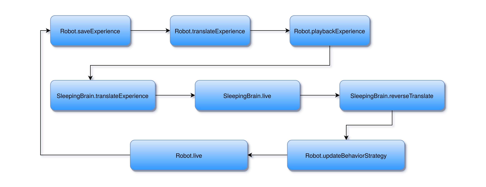
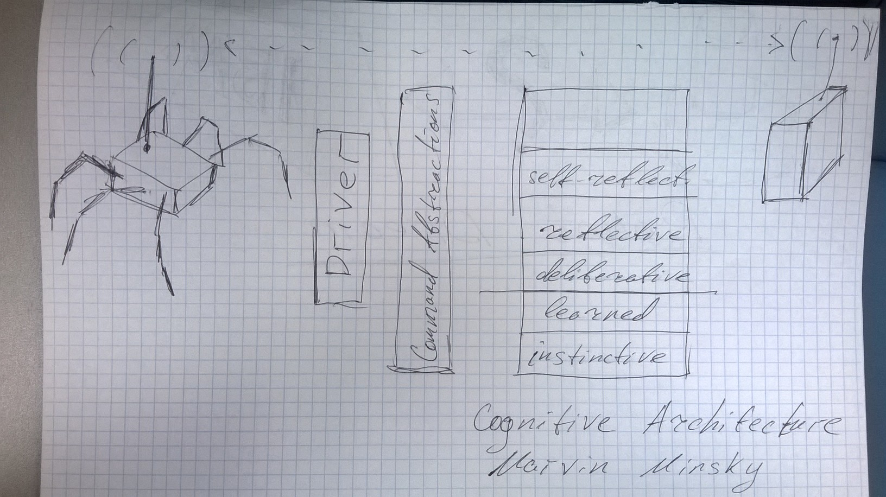

#Robot Dream architecture

##Problem

Rather than implementing the
emotional model in a computational system, we re-implemented the neurobiological 
basis of emotions using simulation [30]. This was done to create a biologically
plausible approach and to validate the results of our simulations from neurobiological 
perspective. The other way around could not provide proper evidence that
the result could be regarded as emotional phenomenon. We used the model of
basic mechanisms of a mammalian brain via neuromodulation and their mapping
to basic affective states [14, 26, 27, 28, 29]. We used the realistic spiking neural
networks with neuromodulation reconstructing all brain structures involved into
the pathways of neuromodulators of the “cube of emotions” by Hugo Lövheim
[14]. Unfortunately, current robotic systems usually do not have enough memory
and computational capacity to run realistic simulations of human brain activity.

For example, this is computational resources of rather advanced bipedal
robotic platform AR-601:

* CPU — 4th Gen Intel Core i7-4700EQ 4-Core 3.4GHz processor;
* System Memory — 1 x204-Pin DDR3L 1333MHz SO-DIMM up to 8 GB;

However the simulation of 1% of human brain required a cluster of 250 K-
supercomputers (each contains 96 computing nodes, each node contains a 2.0
GHz 8-core SPARC64 processor and 16 GB of memory) that was done by KEN
institute in 2013 and this simulation was slower than human brain in 1000 times
[12]. According to the estimates of the Human brain project the computational
capacity to simulate whole human brain should be 30 exaflop that is not feasible 
at the moment.

A realistic simulation even for parts of mammalian brain involved
into neuromodulation processes leading to emotional reactions cannot be done in
real-time even at scale of rat brain (not mention human brain) on an autonomous
robotic platform. To combine autonomous control with advanced realistic emotional 
appraisal we propose life-cycle separation into “day” and “night” phases.

##High level overview 

###Life cycle

Overall robotic system life-cycle is divided into two phases: *wake* (day) and *sleep* (night).

- [**a**] In this position a robotic system transfers the accumulated during *wake* phase experience into realistic neural network of the *sleeping brain*.
- [**b**] Processing of *sleeping phase* is done as follows:
      - The accumulated experience is transferred from a robotic system to the Sleeping brain;
      - Then simulation starts producing a set of updated rules to a robotic system;
      - Finally update is transferred to a robotic system.
x- [**c**] The updated behavior strategies is transferred to a robotic system and applied to it.
- [**d**] The robotic system continues it's wake phase with updated control system strategies, adjusted emotional reactions and accumulating new experience, storing all sensory inputs, to be processed again starting from **a**.

### Translation

The **direct translation** is done in the playback mode similar to a mammalian brain processing of the wake experience. This way whole wake experience should be translated to the sequence of sleeping brain neurons activations based on the semantics of an inbound signals, for example the activations of tactile sensors should be translated into activations of sensory cortex, audio signals should be translated into auditory cortex neurons activations. 

The **reverse translation** is gradual step by step process that could be divided into several phases:

- Increase of abstraction layer of the sleeping brain 
- Translation of rNN of the **sleeping brain** into rule based description of the behavior strategies of a robotic system
- Validation of translation steps
- Validation of overall reverse translation process
- Transfer of rule based behavior strategies into a robotic system.

Overall translation validation is based on overall statistical analysis of the semantically tagged rNN of a sleeping brain highlighting most important neuronal connections using **semantic tagging** to the key concepts.

##HLD

###Use cases

There are three main types of use cases:

1. Live
1. Translate 
   2. Direct
   2. Reverse 
   
The **living** use case is denoting the ordinary life-cycle of a robotic system or sleeping brain. For a robotic system usually consists of real time acting based on updated behavior strategies storing the daily experience with semantic highlighting: object and action tagging, pleasure and pain tagging.

The **translation** use case is denoting the transfer and processing the original stored experience of a robotic system into the form of neural network activity and from neural network into robotic system rules. The **direct** translation in the form of playback of the **wake** phase experience in form of neuronal activity of a sleeping brain, the **reverse** process the updated rNN of a sleeping brain in to rules of a robotic system.

###Components

####Robot life cycle

This is high-level representation of the overall structure of the robotic system with emphasis on the integration with sleeping brain. The **RobotLifeCycle** component provides proper functions for the real-time operations of a robotic system including storage of the **wake** phase experience with semantic tagging. 

#####Semantic tagging

Semantic tagging is the association process of several sensory inputs channels using temporal window.
A robotic system tags time frames, and if possible objects in different input channels based on detected tagging events building associations in a forms of semantic clustering. Tagging events could be:

- pleasure and pain stimulus 
- detected visual object: banana, battery, bright flash, human figure, etc
- detected audio signal: loud sound, word, etc
- sensory stimulus

Different sensory tagged are translated into tagged neuronal structures of the rNN of the sleeping brain during the direct translation phase.

... Add activity diagram here

#####Pleasure and pain

...

####Sleeping brain

The high-level representation of overall structure of the **sleeping brain**. 

The robotic system **ExperienceTranslator** 

... Add steps and validation description here

###Activity

## Application architecture

For the start we adapt our architecture for scenarios where control system
is executed on a workstation or alike and communicates with robotic platform
wirelessly over bluetooth or wi-fi.

So "closest" to a robot layer of the system is a driver that responsible for
sending the actual commands for the robot over appropriate channel
(bluetooth, wi-fi, etc.). On the other side driver interacts with the next
layer of abstract commands (hardware abstraction layer). Driver should
translate abstract commands into concrete ones for particular robotic
system.

For simplicity let's talk about "abstract commands" but we should keep in
mind that this term (and module) should include representation for sensory
signals flowing in the opposite direction: from robot to control system.
Moreover this layer might include representation for internal states of
the control system such like "feel of joy" or "bad feeling". Or just
"reward" and "punishment" signals to itself in the simplest case.

The central part of the system is a cognitive architecture implementation.
Here we adopt 6-layer architecture suggested by Marvin Minsky. For the
prototype we need to implement the first two layers, namely, instinctive
and learned.

The final layer (not depicted on the diagram) is for supercomputer (spiking
neural network) communication. It's responsible for transmission of
collected data, receipt and application of rules update.
