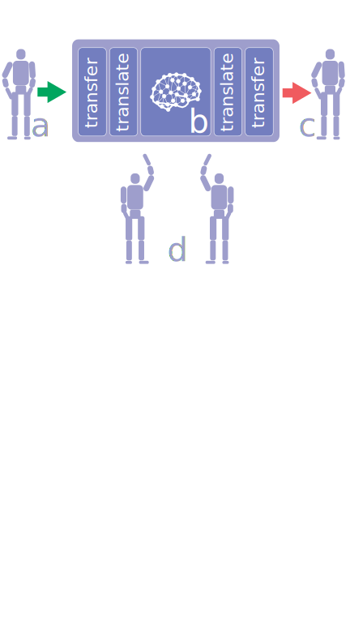
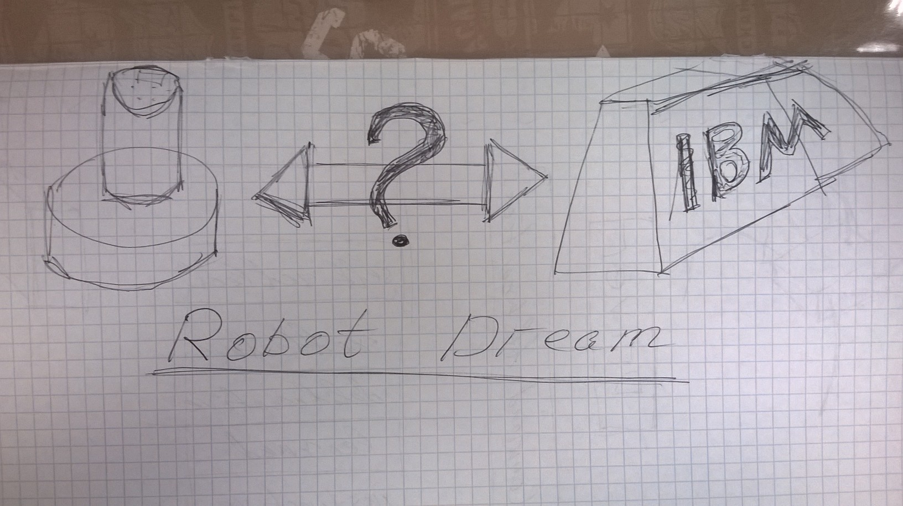

# Robot Dream architecture

## Higlevel overview 

The above diagram depicts overall organization of Robot Dream approach.
On the left it's (improvised) robotic system (like museum robot-guide)
that have to communicate with humans and need to react in (soft) real-time.
On the right there is a supercomputer (like Blue Gene) that is capable of
complex emotional appraisal and processing via simulation of spiking neural
network with neuromodulation (see NEUCOGAR project).

Robot Dream project strives to reconcile these two systems by means of
staged information exchange.

1. Robot governed by rules-based system accumulates and stores all inbound signals.
2. At some point robot "goes to sleep" and transmits stored information to supercomputer system.
3. Supercomputer starts processing of recieived information with the spiking neural network.
4. Spiking neural network produces updates to robot's rules to accommodate emotional responses.
5. Robot receives and applies updated rules the starts a new cycle.

## Application architecture

For the start we adapt our architecture for scenarios where control system
is executed on a workstation or alike and communicates with robotic platform
wirelessly over bluetooth or wi-fi.

So "closest" to a robot layer of the system is a driver that responsible for
sending the actual commands for the robot over appropriate channel
(bluetooth, wi-fi, etc.). On the other side driver interacts with the next
layer of abstract commands (hardware abstraction layer). Driver should
translate abstract commands into concrete ones for particular robotic
system.

For simplicity let's talk about "abstract commands" but we should keep in
mind that this term (and module) should include representation for sensory
signals flowing in the opposite direction: from robot to control system.
Moreover this layer might include representation for internal states of
the control system such like "feel of joy" or "bad feeling". Or just
"reward" and "punishment" signals to itself in the simplest case.

The central part of the system is a cognitive architecture implementation.
Here we adopt 6-layer architecture suggested by Marvin Minsky. For the
prototype we need to implement the first two layers, namely, instinctive
and learned.

The final layer (not depicted on the diagram) is for supercomputer (spiking
neural network) communication. It's responsible for transmission of
collected data, receipt and application of rules update.
