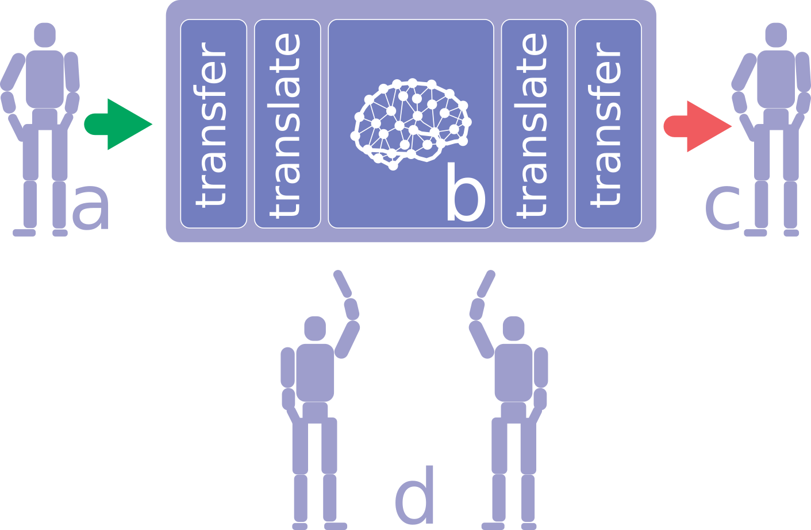
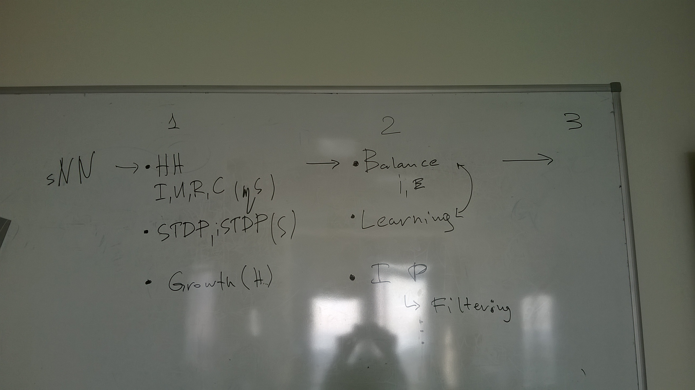

# Robot Dream architecture

## Problem

Rather than implementing the
emotional model in a computational system, we re-implemented the neurobiological
basis of emotions using simulation [30]. This was done to create a biologically
plausible approach and to validate the results of our simulations from neurobiological
perspective. The other way around could not provide proper evidence that
the result could be regarded as emotional phenomenon. We used the model of
basic mechanisms of a mammalian brain via neuromodulation and their mapping
to basic affective states [14, 26, 27, 28, 29]. We used the realistic spiking neural
networks with neuromodulation reconstructing all brain structures involved into
the pathways of neuromodulators of the “cube of emotions” by Hugo Lövheim
[14]. Unfortunately, current robotic systems usually do not have enough memory
and computational capacity to run realistic simulations of human brain activity.

For example, this is computational resources of rather advanced bipedal
robotic platform AR-601:

* CPU — 4th Gen Intel Core i7-4700EQ 4-Core 3.4GHz processor;
* System Memory — 1 x204-Pin DDR3L 1333MHz SO-DIMM up to 8 GB;

However the simulation of 1% of human brain required a cluster of 250 K-
supercomputers (each contains 96 computing nodes, each node contains a 2.0
GHz 8-core SPARC64 processor and 16 GB of memory) that was done by RIKEN
institute in 2013 and this simulation was slower than human brain in 1000 times
[12]. According to the estimates of the Human brain project the computational
capacity to simulate whole human brain should be 30 exaflop that is not feasible
at the moment.

A realistic simulation even for parts of mammalian brain involved
into neuromodulation processes leading to emotional reactions cannot be done in
real-time even at scale of rat brain (not mention human brain) on an autonomous
robotic platform. To combine autonomous control with advanced realistic emotional
appraisal we propose life-cycle separation into “day” and “night” phases.

## High level overview

### Life cycle ("dream-wake" cycle)

Overall robotic system life-cycle is divided into two phases: *wake* (day) and *dream* (night).

- [**a**] In this position a robotic system transfers the accumulated during *wake* phase experience into spiking neural network of the *dreaming brain*.
- [**b**] Processing of *dreaming phase* is done as follows:
  - The accumulated experience is transferred from a robotic system to the dreaming brain;
  - Then simulation starts producing a set of updated rules to a robotic system;
  - Finally update is transferred to a robotic system.
- [**c**] The updated behavior strategies is transferred to a robotic system and applied to it.
- [**d**] The robotic system continues it's wake phase with updated control system strategies, adjusted emotional reactions and accumulating new experience, storing all sensory inputs, to be processed again starting from **a**.

### Training 

We propose to use mammalian dream analogy for the training process either.
During the "maturation" "wake-dream" cycles should become more inclined towards "wake" phase but originally the system should be more "dreaming" rather than actively acting. The purpose of this "dream-wake" balancing is to provide more frequent thus intensive "dreaming" rather than acting to adapt and update the rule-based system to the real world environment.

One of possibles scenario could be that originally the robotic system should not have any preset (instinctive) rules. If the robotic system receives any painful feedback (for example hits the wall) it should be unable to react accordingly to situation. During "dreaming" phase the "dreaming brain" that should not have any preset reaction should try any random motor reaction that in its turn should be translated as rule to the robotic system. The robotic system will use this action: if this reaction reduces the pain the robotic system registers the "pain relief". The "pain relief" translated into the "dreaming brain" triggers the reward system that in its turn reinforce the association of painful sensory input with the action. On the other hand if the action does not lead to "pain relief" the pain sensory input persist and is still been translated into the "dreaming brain". The dreaming brain should try other random action and the whole "robot dream" should repeat the cycle of "dream-wake".

The other possible option could be: the robotic system would have predefined (instinctive) rules, that should be translated into neuronal structures of the "dreaming brain". This way we should use "bisimulation" approach described in our article: "Robot Dream" to adapt the "dreaming brain" first to the instinctive rules.

### Translations

The **direct translation** is done in the playback mode similar to a mammalian brain processing of the wake experience. This way whole wake experience should be translated to the sequence of dreaming brain neurons activations based on the semantics of an inbound signals, for example the activations of tactile sensors should be translated into activations of sensory cortex, audio signals should be translated into auditory cortex neurons activations.

The **reverse translation** is gradual step by step process that could be divided into several phases:

- Increase of abstraction layer and generalize the "**dreaming brain**" spiking neural network (**sNN**) connections
- Translation of the **sNN** of the "**dreaming brain**" into rule based description of the behavior strategies of a robotic system
- Validation of translation steps
- Validation of overall reverse translation process
- Transfer of rule based behavior strategies into a robotic system.

Overall translation validation is based on overall statistical analysis of the semantically tagged sNN of a dreaming brain highlighting most important neuronal connections using [**semantic tagging**](architecture.md#experiencetranslatorsemantictagger) to the key concepts.

## HLD

### Use cases

There are three main types of use cases:

1. Live
1. Translate
  2. Direct
  2. Reverse

The **living** use case is denoting the ordinary life-cycle of a robotic system or dreaming brain. For a robotic system usually consists of real time acting based on updated behavior strategies storing the daily experience with semantic highlighting: object and action tagging, pleasure and pain tagging.

The **translation** use case is denoting the transfer and processing the original stored experience of a robotic system into the form of neural network activity and from neural network into robotic system rules. The **direct** translation in the form of playback of the **wake** phase experience in form of neuronal activity of a dreaming brain, the **reverse** process the updated sNN of a dreaming brain in to rules of a robotic system.

### Activity

Overall the robot to the dreaming brain synchronization life-cycle.
- "**Wake phase**"
  - Firstly the robotic system stores the experience of every sensory channel, including pleasure and pain tags.
  - During the **direct translation** the robotic system transmits the stored information to the **dreaming brain**.
- "**Dreaming phase**"
  - The **dreaming brain** plays back the transmitted experience by means of spiking neuronal network  (sNN) neurons activation (translating).
  - The **dreaming brain** runs the simulation life-cycle updating the sNN.
  - During the **reverse translation** the **dreaming brain** runs the number of activities to translate the updated structure of sNN into rules of behavioral strategies of the robotic system.
  - The robotic system updates behavioral strategies and runs the real-time or semi real-time life-cycle, storing new experience.

 Practically speaking the dreaming phase of the dreaming brain and the wake phase of the robotic system could overlap and process simultaneously.

### Components

#### Robot

This is a high-level representation of the overall structure of the robotic control system.
The control system might be embedded into robotic platform of executed on remote
machine wirelessly communicating with the robot.

The **RobotLifeCycle** component provides proper functions for real-time operation
of a robotic system via the **RuleBasedSystem** including storage of the **wake** phase experience and translation
into the **dreaming brain**.

The **DriverInterface** is responsible for communication with the underlying
hardware platform. It translates abstract commands into concrete ones for particular
robotic system.

The central part of the system is a cognitive architecture implementation.
The component is named **ModelOfSix** as we adopt "model of six" proposed by Marvin Minsky.
It contains six interconnected behavioral layers: instinctive, learned, deliberative,
reflective, self-reflective and self-conscious. Each layer implements appropriate
rules-based inference adopting if-do-then rules.

During its course of operation robotic system records inbound information for later
transmission to the **dreaming brain**. **ExperienceStorage** component keeps all
this data until **DirectTransmitter** transfers it to a supercomputer.

##### DirectTransmitter (Direct translation)

Transfer of the stream of stored and tagged experience from the robotic system into
the dreaming brain.

For transmission of signals we're adopting NEST file format. For further
details please consult [this description](direct_translation_format.md).

##### RuleBasedSystem (Robot life cycle)

Due to the (quasi) real-time requirement we propose to use TU framework, based on the “Critic-Selector-Way to think” (T3) model, it helps us to implement the rule based system managing the robotic system. The T3 “Critic-Selector-Way to think” triplet is inherited from the works of [Marvin Minsky](https://en.wikipedia.org/wiki/The_Emotion_Machine). This approach provides an option to evaluate incoming sensory data over the stored knowledge in the knowledge base. The input information of the TU framework [2] is textual while in this work we propose to use spikes for the representation of input and processing information of the TU framework. The TU framework is based on probabilistic rules and uses logical reasoning with the 6-levels of mental activity and T3 over spikes.

###### Probabilistic Critic

Probabilistic critic is the implementation of critic from the T3 “Critic-Selector-Way to think” triplet. Spikes trigger several critics, that start inbound information processing in parallel on several levels of mental activity. Critics are grouped in contexts based on their level of mental activity and semantics of the processing information (audial, visual, tactile). The activation of one critic of the context increases the probability of triggering corresponding critics on the same context. This way every critic is a temporal probabilistic predicate that contains set of rules that are evaluated not only over the incoming information, but over current system state and context of recently processed information.

The incoming set of spikes S1 triggers the pattern P1 of critics on two levels: instinctive (basic reflexes) and learned (simple-trained reactions). The pattern P1 and the next set of spikes trigger two patterns P2 on learned level and P3 on the instinctive levels. Later these two patters trigger two more patters one on each level: P4 and P5. This mechanism of spiking reasoning system is inspired by the “Hierarchical temporal memory” HTM approach [5] and in a similar way has predictive mechanism: the activation of the pattern P1 could be used as the indication of the S2 set of spikes. To use the advantages of training we propose to extend logical rules with weight value similar to confidence value in [NARS](https://github.com/opennars/opennars/wiki). 

###### Way to think

A way to think is a main activity to change the content of memory and perform an action [4]. A way to think runs a workflow that could trigger the hardware controller of the robotic system or change the data of the information processing context. We propose the following workflow:

1. Spike hits the system;
2. The system creates inbound context for this spike based on its attributes: source channel (visual, audial, ...), time, number of activated neurons, neurotransmitters, previously processed information, see Data Structures section for the details;
3. The system starts processing the spike;
4. Several Critics are activated by based on resulting probability of their rules;
5. Several spikes are accumulated in the system state and when their number reaches the threshold the motor reaction is triggered;
6. The critic activates a way to think;
7. The way to think generates data for controllers.

###### Data structures
According to our approach, the input from robots is encoded by spikes. A spike is an abstract object with following attributes:

1. Source channel;
2. Timing: start time, duration.
3. Semantic tag of the event to be processed.
4. Number of activated neurons.
5. Neurotransmitters used to generate this spike.
6. Previously processed information context.

#### DreamingBrain

##### Reasoning system solution

The high-level representation of overall structure of the **DreamingBrain** component in reasoning system solution.

##### Memristive system solution

The high-level representation of overall structure of the **DreamingBrain** component in reasoning system solution.

##### Direct translation

The **ExperienceTranslator** includes **ExperiencePlayer** that translates different types of tagged inbound sensory inputs transferred from robotic system into neuronal activities of sNN of the dreaming brain in the form of synchronous playback of neuronal activations based on wiring of sensory channel to the dreaming brain area.

###### ExperienceTranslator.ExperiencePlayer.AuditoryPlayer

...

###### ExperienceTranslator.ExperiencePlayer.VisualPlayer

...

###### ExperienceTranslator.ExperiencePlayer.TactilePlayer

...

###### ExperienceTranslator.ExperiencePlayer.PainPlayer

...

###### ExperienceTranslator.ExperiencePlayer.PleasurePlayer

...

###### ExperienceTranslator.SemanticTagger

Semantic tagging is the association process of several sensory inputs channels using temporal window.
A robotic system tags time frames, and if possible objects in different input channels based on detected tagging events building associations in a forms of semantic clustering. Tagging events could be:

- pleasure and pain stimulus
- detected visual object: banana, battery, bright flash light, human figure, etc
- detected audio signal: loud sound, word, etc
- sensory stimulus

Different sensory tagged are translated into tagged neuronal structures of the sNN of the dreaming brain during the direct translation phase.

###### Tagging of the "dreaming brain" structures

Comprehensive description available in [wikipedia](https://en.wikipedia.org/wiki/Somatosensory_system).

As depicted on the schema above the tagging of somatosensory input goes from the brain stem via thalamus to sensory cortex. Further processing could involve limbic system, prefrontal cortex and eventually motor cortex. SemanticTagger should mark neuronal structures of the "dreaming brain" involved in processing sensory information in areas listed above but should not be limited to reactive sensory only processing also tagging should involve thinking processes not directly triggered by one sensory input possibly as mixture of tags.

###### ExperienceTranslator.ExperiencePlayer.Pleasure and pain

According to the dissertation "Neurocomputational Mechanisms for Adaptive Self-Preservative Robot Behaviour" by Nicolás Ignacio Navarro Guerrero, the main structures involved in pain processing: PFC, VTA, thalamus, amygdala, PAG, RRF, hippocampus. These structures are implemented in the [NeuCogAr project](https://github.com/research-team/neucogar). For the detailed description of pleasure and pain via nociception see chapter 6, for the detailed description of fear conditioning see chapter 7 of the dissertation.

...

##### Dreaming Phase

###### DreamingBrainLifeCycle

The life cycle of the sNN simulated brain is still open question.
Most obvious approach is to run the simulation of wake processing of the sensory inputs of the brain updating synaptic weights, updating associations and circuits. This could be understood as the starting point of the "dreaming brain" processing approach. The alternative could be reimplementation of mammalian dreaming phases in the simulated "dreaming brain" that still is not completely clear from the computational system functioning perspective. This way we propose to gradually move from simple implementation of wake processing of the simulated brain to possibly dream phases implementation eventually we could reach the "wake-dream" phases of a mammalian brain.

###### DreamingBrainLifeCycle.AbstractionLayer

The granularity level of the sNN could be switched in several ways for example instead of Hodgkin–Huxley model the integrate and fire could be used.
The other way is to take in account events of a different time scale: **spikes** and electro-chemical activity including changes of conductance, resistance, current and potential in the **milliseconds** timescale; spike timing plasticity (excitatory, inhibitory) in the **seconds** timescale; long term as well as structural plasticity in the **hours** timescale.

<!--  -->

###### DreamingBrainLifeCycle.Appraisal

...

###### DreamingBrainLifeCycle.CubeOfEmotions

...

##### Reverse translation

The **ReverseTranslator** component is responsible for the translation of neuronal structures and activities or the dreaming brain into the robotic system **RuleBasedSystem**. The translation process could be divided into principal phases:

- rising abstraction layer or the sNN of the "**dreaming brain**" reducing computational load making sNN operate in sub-real-time mode done by **DreamingBrainLifeCycle**
- generalization and convolution neuronal structures into rules of the robotic system **RuleBasedSystem** via **GeneralisationStrategy** and its components: **Narrative**, **Induction**, **Abduction**, **OntologyBased**.
- generalization and convolution are gradual stepwise processes that include 2 types of validation: **StepValidator** and overall **OverallValidator**.

###### ReverseTranslator.GeneralisationStrategy.Narrative

The narrative is the form of generalization of logical rules and neuronal circuits into logical rules based on temporal sequential patterns.
The sequential neuronal pattern could be generalized into form of higher level concept or and consequent of the pattern activation.
From the perspective of temporal logical rules the sequence of logical patterns could be generalized in the form of logical inference final consequent. The narrative could be understood as form of clustering of neuronal pattern circuits in high-level abstractions as well as sequential patterns of temporal [probabilistic] logic in high-level logical concepts.

###### ReverseTranslator.GeneralisationStrategy.Induction

...

###### ReverseTranslator.GeneralisationStrategy.Abduction

...

###### ReverseTranslator.GeneralisationStrategy.OntologyBased

...

###### ReverseTranslator.Validator

During the **reverse translation** phase these pattern and circuits are generalized into high-level logical rules via mechanisms described above.
The number of representations of objects is reduced, but the **StepValidator** tracks the adequacy of processing via selecting most important according to the number of tagged connections events(objects) and persist them for further processing. If a important object was deleted during processing the system start the processing stage from the begging using less strict generalization rules.

 Where the **OverallValidator** does validation based on number of neuronal connections to the pattern tagged with one event. The threshold value of the connection could be set as for example 20 percent per step and 60 percent per overall process (this should be clarified).

