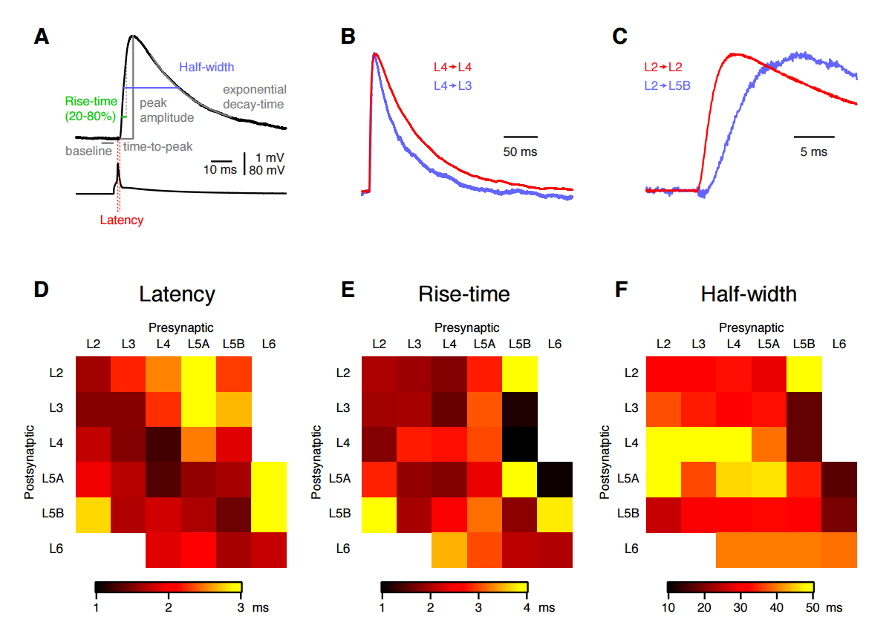

## Review of somatosensory cortex (Mouse brain)

### Cortical layers

> Examples of different dendritic morphologies found in the mouse C2 barrel column. Layer boundaries are drawn to scale at their mean subpial distance **([1])**

## Neuron number
<table>
	<tr align="center">
		<td><b>Layer<td><b>Glu<td><b>GABA<td rowspan="7">
	<tr>
		<td align=right><b>L2<td>546 ± 49<td>107 ± 7
	<tr>
		<td align=right><b>L3<td>1145 ± 132<td>123 ± 19
	<tr>
		<td align=right><b>L4<td>1656 ± 83<td>140 ± 9
	<tr>
		<td align=right><b>L5A<td>454 ± 46<td>90 ± 14
	<tr>
		<td align=right><b>L5B<td>641 ± 50<td>131 ± 6
	<tr>
		<td align=right><b>L6<td>1288 ± 84<td>127 ± 9
</table>

> Estimated numbers (mean ± SEM) of excitatory and inhibitory cells in different layers of the mouse C2 barrel column **([1])**

### Excitatory connection probability (%)

<table>
  <tr align=center font-weight=bold>
    <td>
    <td><b>→ L2
    <td><b>→ L3
    <td><b>→ L4
    <td><b>→ L5a
    <td><b>→ L5b
    <td><b>→ L6
  <tr>
    <td align=right><b>L2 →  <td>9.3  <td>12.1 <td>12.0 <td>4.3  <td>0.96 <td>0
  <tr>
		<td align=right><b>L3 →  <td>5.5  <td>18.7 <td>14.5 <td>2.2  <td>1.8  <td>0
  <tr>
		<td align=right><b>L4 →  <td>0.96 <td>2.4  <td>24.3 <td>0.7  <td>0.7  <td>0
  <tr>
		<td align=right><b>L5a → <td>9.5  <td>5.7  <td>11.6 <td>19.1 <td>1.7  <td>0.6
  <tr>
		<td align=right><b>L5b → <td>8.3  <td>12.2 <td>8.1  <td>8.0  <td>7.2  <td>2
  <tr>
		<td align=right><b>L6 →  <td>0    <td>0    <td>3.2  <td>3.2  <td>7.0  <td>2.8
</table>
> The layer-specific mean input and output connectivity from L2, L3, L4, L5A, L5B and L6 **([1])**

<table>
	<tr> 
		<td width="55%">
		<td>INFO
	<tr> 
		<td width="55%">
		<td>INFO
	<tr> 
		<td width="55%">
		<td align="justify">
		Tactile information relating to single whisker deflections is in part signaled via thalamocortical neurons of the ventral posterior medial nucleus (VPM) providing important input to L4 neurons. With their strong output connectivity to other cortical layers, the excitatory neurons of L4 are in a good position to distribute this sensory information to both supragranular and infragranular cortical layers within the C2 barrel column.

	<tr> 
		<td width="55%">
		<td>INFO
	<tr> 
		<td width="55%">
		<td>INFO
	<tr> 
		<td width="55%">
		<td>INFO
</table>

## Strength inputs in L2/3

> Laminar patterns of excitatory and inhibitory input to L2/3 pyramidal cells derived from glutamate uncaging in vitro. Example maps of excitatory (left) and inhibitory (middle) input to pyramidal neurons. A reconstruction of the neuron’s cell body and major dendrites is shown in black or white over the color-coded input maps. The color scale codes evoked input in units of picoamperes measured after photostimulation for each stimulation site. Right: summary data of laminar excitatory (top) and inhibitory (bottom) input strength onto L2/3 pyramidal neurons **([3])**

## Delays

>(A) Latency was measured from AP peak to uEPSP onset. Rise-time was measured from
20% to 80% of the peak uEPSP amplitude. Time-to-peak was measured from latency to
peak. Half-width indicates the measured full-width at half-maximal response amplitude.
Decay-time was the time constant obtained from a single exponential fit of 80% to 20% on
the falling phase of the uEPSP.  
(B) Example experiments showing differences in uEPSP duration. An example synaptic
connection between two L4 neurons (red) has a longer duration compared to a different
example experiment with a synaptic connnection from a L4 neuron to a L3 neuron (blue).
The traces have been scaled so that the peak of the uEPSP has the same amplitude.  
(C) Example experiments showing differences in uEPSP latency. An example synaptic
connection between two L2 neurons (red) has a shorter latency than a different example
experiment showing a connection from L2 to L5B (blue). The traces have been scaled so
that the peak of the uEPSP has the same amplitude.  
(D) Color-coded matrix of layer specific uEPSP latencies.  
(E) Color-coded matrix of layer specific uEPSP rise-times.  
(F) Color-coded matrix of layer specific uEPSP half-widths **([4])**

## Connections

> Origin **([3])**

## References
[1]: http://www.cell.com/neuron/abstract/S0896-6273(08)01092-1
[2]: http://neuronaldynamics.epfl.ch/online/Ch12.S1.html
[3]: http://www.cell.com/neuron/abstract/S0896-6273(13)00267-5
[4]: http://www.cell.com/cms/attachment/604400/4788014/mmc1.pdf

- **[1]** The Excitatory Neuronal Network of the C2 Barrel Column in Mouse Primary Somatosensory Cortex
- **[2]** Columnar organization (Online book)
- **[3]** Synaptic Computation and Sensory Processing in Neocortical Layer 2/3
- **[4]** Supplemental Data. The Excitatory Neuronal Network of the C2 Barrel Column in Mouse Primary Somatosensory Cortex
