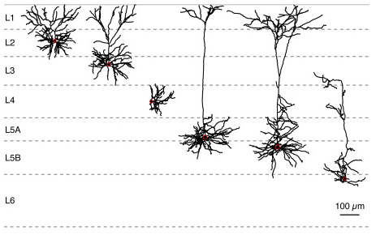
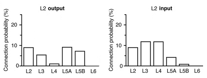
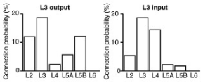
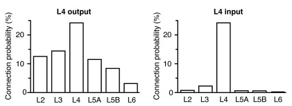
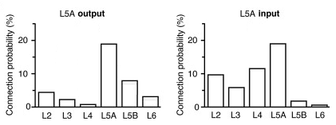
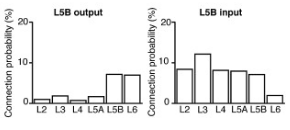
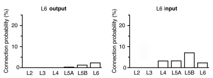
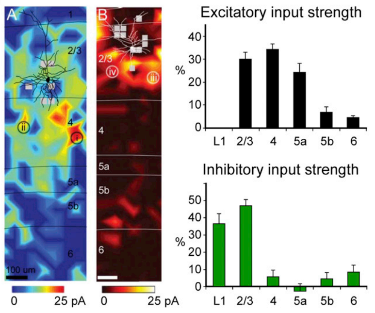
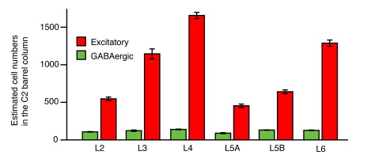
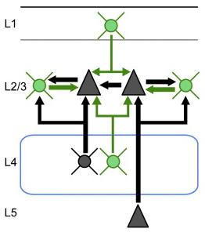

## Review of somatosensory cortex

### Cortical layers

### Excitatory connection probability (%)

<table>
  <tr align=center font-weight=bold>
    <td>
    <td><b>→ L2
    <td><b>→ L3
    <td><b>→ L4
    <td><b>→ L5a
    <td><b>→ L5b
    <td><b>→ L6
  <tr>
    <td align=right><b>L2 →  <td>9.3  <td>12.1 <td>12.0 <td>4.3  <td>0.96 <td>0
  <tr>
		<td align=right><b>L3 →  <td>5.5  <td>18.7 <td>14.5 <td>2.2  <td>1.8  <td>0
  <tr>
		<td align=right><b>L4 →  <td>0.96 <td>2.4  <td>24.3 <td>0.7  <td>0.7  <td>0
  <tr>
		<td align=right><b>L5a → <td>9.5  <td>5.7  <td>11.6 <td>19.1 <td>1.7  <td>0.6
  <tr>
		<td align=right><b>L5b → <td>8.3  <td>12.2 <td>8.1  <td>8.0  <td>7.2  <td>2
  <tr>
		<td align=right><b>L6 →  <td>0    <td>0    <td>3.2  <td>3.2  <td>7.0  <td>2.8
</table>

<table>
	<tr> 
		<td width="55%">
		<td>INFO
	<tr> 
		<td width="55%">
		<td>INFO
	<tr> 
		<td width="55%">
		<td align="justify">
		Tactile information relating to single whisker deflections is in part signaled via thalamocortical neurons of the ventral posterior medial nucleus (VPM) providing important input to L4 neurons. With their strong output connectivity to other cortical layers, the excitatory neurons of L4 are in a good position to distribute this sensory information to both supragranular and infragranular cortical layers within the C2 barrel column.

	<tr> 
		<td width="55%">
		<td>INFO
	<tr> 
		<td width="55%">
		<td>INFO
	<tr> 
		<td width="55%">
		<td>INFO
</table>

## Strength inputs in L2/3 [Link](http://www.cell.com/neuron/fulltext/S0896-6273(13)00267-5)

## Neuron number (MOUSE BRAIN!!!) [Link](http://www.sciencedirect.com/science/article/pii/S0896627308010921)

<table>
	<tr align="center">
		<td><b>Layer <td><b>Glu <td><b>GABA <td rowspan="7"></img>
	<tr>
		<td align=right><b>L2 <td>546 ± 49 <td>107 ± 7
	<tr>
		<td align=right><b>L3 <td>1145 ± 132 <td>123 ± 19
	<tr>
		<td align=right><b>L4 <td>1656 ± 83 <td>140 ± 9
	<tr>
		<td align=right><b>L5A<td>454 ± 46 <td>90 ± 14
	<tr>
		<td align=right><b>L5B<td>641 ± 50 <td>131 ± 6
	<tr>
		<td align=right><b>L6<td>1288 ± 84 <td>127 ± 9
</table>

## Connections
[Link](http://www.cell.com/neuron/fulltext/S0896-6273(13)00267-5)

